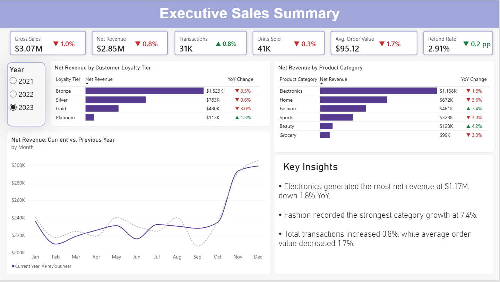
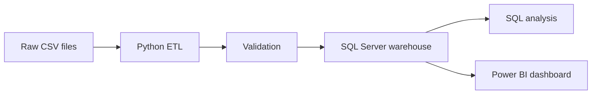
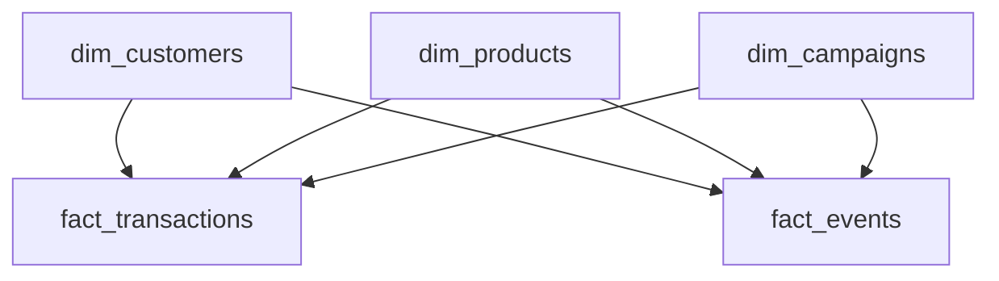

# Marketing Analytics Data Warehouse and Power BI Dashboard

An end-to-end marketing and e-commerce analytics project that transforms raw CSV data into a validated SQL Server dimensional warehouse and an interactive Power BI executive dashboard.

The original goal was to analyze customer journeys, campaign performance, experiments, and sales. However, exploratory analysis and dedicated SQL validation revealed that several important fields did not behave as their labels suggested.

As a result, a major part of this project was determining what the data could and could not support. The analysis required investigating contradictions, testing assumptions, interpreting ambiguous source-system behaviour, and narrowing the reporting scope to conclusions that could be defended. The final executive sales summary is therefore an intentionally focused output of that validation process rather than the full extent of the analysis performed.

This project demonstrates exploratory analysis, critical evaluation of data quality, Python ETL development, dimensional modelling, SQL validation and analysis, KPI design, Power BI reporting, and responsible communication of analytical limitations.

## Analytical Challenge

The dataset appeared to support a broad marketing analytics solution, but its logical and temporal inconsistencies made many expected analyses unreliable. The central challenge became separating structurally valid data from analytically trustworthy data.

The project therefore focused on three questions:

- Do the fields and relationships behave as their names and documentation imply?
- Which proposed metrics would produce misleading conclusions?
- What useful information can still be reported after applying appropriate limitations?

The resulting dashboard emphasizes sales, customer segments, product categories, discounts, and refunds because these were the strongest supported areas. Unsupported session, lifecycle, experiment, and causal campaign analyses were deliberately excluded.

## Dashboard



The dashboard presents the reliable subset of the analysis as an annual executive sales summary. It includes year-over-year comparisons for gross sales, net revenue, transaction records, units sold, average order value, refund rate, customer loyalty tiers, and product categories. Its focused scope reflects the findings of the data-quality investigation described below.

### 2023 performance

| KPI | Result | Year-over-year change |
| --- | ---: | ---: |
| Gross Sales | $3.07M | -1.0% |
| Net Revenue | $2.85M | -0.8% |
| Transaction Records | 30.9K | +0.8% |
| Units Sold | 41.2K | -0.3% |
| Average Order Value | $95.12 | -1.7% |
| Refund Rate | 2.91% | -0.2 percentage points |

## Business Objective

The project began with broader marketing-analysis expectations, but the final business questions were refined according to the validation results:

- How are gross sales, net revenue, transaction volume, units sold, average order value, and refunds changing over time?
- Which customer loyalty tiers contribute the most net revenue?
- Which product categories generate the most revenue and which are growing fastest?
- Where are the largest changes occurring compared with the previous year?
- Which parts of the source data are reliable enough to support business decisions?

## Key Findings

- **Electronics remained the largest category**, generating approximately $1.17M in 2023 net revenue, although revenue declined 1.8% year over year.
- **Fashion recorded the strongest category growth**, increasing 7.4% year over year.
- **Transaction records increased 0.8%**, but average order value declined 1.7%, contributing to a 0.8% decrease in net revenue.
- **Bronze customers generated the most net revenue** because they represent the largest loyalty segment, while higher loyalty tiers produced greater average order values.
- **Refund performance improved slightly**, with the refund rate decreasing by 0.2 percentage points in 2023.

## Business Recommendations

- Investigate the decline in average order value through product-mix, discount, and customer-segment analysis.
- Examine whether successful Fashion products or promotions can inform strategies for categories with declining revenue.
- Protect Electronics revenue by identifying the products and loyalty segments contributing most to its year-over-year decline.
- Use cross-sell, bundling, or loyalty strategies to increase order value while monitoring their effect on discount and refund rates.
- Treat campaign comparisons as descriptive only until campaign exposure and timing data can be validated.

## Solution Architecture



### Workflow

1. **Extract:** Load the raw customer, product, campaign, event, and transaction files with pandas.
2. **Transform:** Standardize data types and categorical values, handle campaign reference records, remove unusable purchase records, and calculate transaction-level gross revenue.
3. **Validate:** Test required columns, primary and foreign keys, nullability, allowed values, numeric ranges, and dates before loading.
4. **Load:** Append validated dimension and fact tables to SQL Server in dependency order using SQLAlchemy.
5. **Analyze:** Use T-SQL and DAX to calculate business KPIs, time trends, customer performance, and product performance.
6. **Report:** Present the results in an interactive Power BI executive dashboard.

## Data Model

The SQL Server warehouse uses a dimensional model with shared customer, product, and campaign dimensions.



| Table | Grain |
| --- | --- |
| `dim_customers` | One row per customer |
| `dim_products` | One row per product |
| `dim_campaigns` | One row per campaign, plus an unattributed reference record |
| `fact_transactions` | One row per retained transaction record |
| `fact_events` | One row per recorded digital event |

The Power BI model also includes a dedicated Date table connected separately to the transaction and event facts. The two fact tables are not directly related.

Detailed column definitions, data types, calculation rules, and known limitations are available in the [data dictionary](docs/data_dictionary.md).

## Metric Interpretation

Refunded transactions are assumed to have been changed in place in the source system. A refunded row represents the latest state of the original transaction rather than an additional refund event. Therefore, net revenue includes only non-refunded transactions.

Detailed KPI definitions and calculation rules are available in the [data dictionary](docs/data_dictionary.md)

## Data Validation and Responsible Analysis

The source is a synthetic dataset containing structurally valid records but several logical and temporal inconsistencies. Dedicated SQL validations were used to determine which analyses could be supported.

### Main validation findings

- Only approximately 5% of campaign-linked activity occurred within the corresponding campaign dates.
- More than 84% of session IDs were associated with multiple customers and spanned implausibly long periods.
- Experiment-group assignments were not stable at the customer or customer-campaign level.
- Approximately half of the fact activity occurred before the associated customer signup or product launch date.
- All 92,678 retained purchase events reconciled one-to-one with retained transaction records.

### Analytical decisions

The final analysis supports:

- Calendar-based sales and event trends
- Customer and loyalty-tier comparisons
- Product and category performance
- Transaction, discount, and refund analysis
- Aggregate event-count ratios
- Descriptive campaign comparisons using source-provided identifiers

The project does **not** use the data for:

- Session conversion or bounce rates
- Ordered customer journeys
- Customer or product lifecycle analysis
- Campaign exposure, incremental impact, or causal uplift
- Conventional A/B testing or statistical significance testing

These decisions prevent unreliable fields from producing unsupported business conclusions. Full details are available in the [data validation report](docs/data_validation_report.md) and [data dictionary](docs/data_dictionary.md).

## Technologies

- **Python:** pandas, SQLAlchemy, pyodbc
- **SQL Server:** dimensional modelling, constraints, indexes, validation, and analytical queries
- **Power BI:** data modelling, DAX measures, conditional formatting, dynamic insights, and interactive reporting
- **Development:** VS Code, SQL Server Management Studio, Git, and GitHub

## Repository Structure

```text
marketing-analytics-project/
├── README.md
├── dashboard/
│   ├── executive_sales_summary.png
│   └── marketing_analytics_dashboard.pbix
├── data/
│   └── README.md
├── docs/
│   ├── data_dictionary.md
│   └── data_validation_report.md
├── notebooks/
│   └── 01_eda.ipynb
├── sql/
│   ├── analysis/
│   ├── data_validation/
│   └── schema/
├── src/
│   ├── config.py
│   ├── database.py
│   ├── extract.py
│   ├── transform.py
│   ├── validate.py
│   ├── load.py
│   ├── logging_config.py
│   └── run_pipeline.py
├── .gitignore
└── requirements.txt
```

Raw data, credentials, logs, database files, and local environment files are excluded from version control.

## Running the Project

### Prerequisites

- Python 3.10 or later
- SQL Server
- Microsoft ODBC Driver for SQL Server
- Power BI Desktop

### Setup

1. Clone the repository and create a virtual environment.
2. Install the Python dependencies:

   ```bash
   pip install -r requirements.txt
   ```

3. Place the source CSV files in the configured raw-data directory.
4. Configure the local SQL Server connection in `src/config.py` or with environment variables.
5. Run the SQL schema scripts in `sql/schema/`.
6. Run the ETL pipeline from the project root:

   ```bash
   python -m src.run_pipeline
   ```

7. Run the validation and analysis scripts in SQL Server Management Studio.
8. Open the Power BI report and refresh the model using the local SQL Server connection.

## Dataset

The project uses the synthetic **Marketing and E-commerce Analytics Dataset** from Kaggle. The raw source files are not included in this repository.

Because the data is synthetic, the findings should be interpreted as a demonstration of analytical and engineering practice rather than evidence about a real company. The project focuses on building a trustworthy workflow, identifying data limitations, and communicating only conclusions supported by the available data.

## Skills Demonstrated

- End-to-end analytics solution design
- Python ETL development and logging
- Automated data validation
- SQL Server dimensional modelling
- T-SQL analysis and KPI development
- Power BI modelling and DAX
- Dashboard design and business storytelling
- Data-quality investigation and responsible interpretation
- Technical documentation and reproducible project organization
